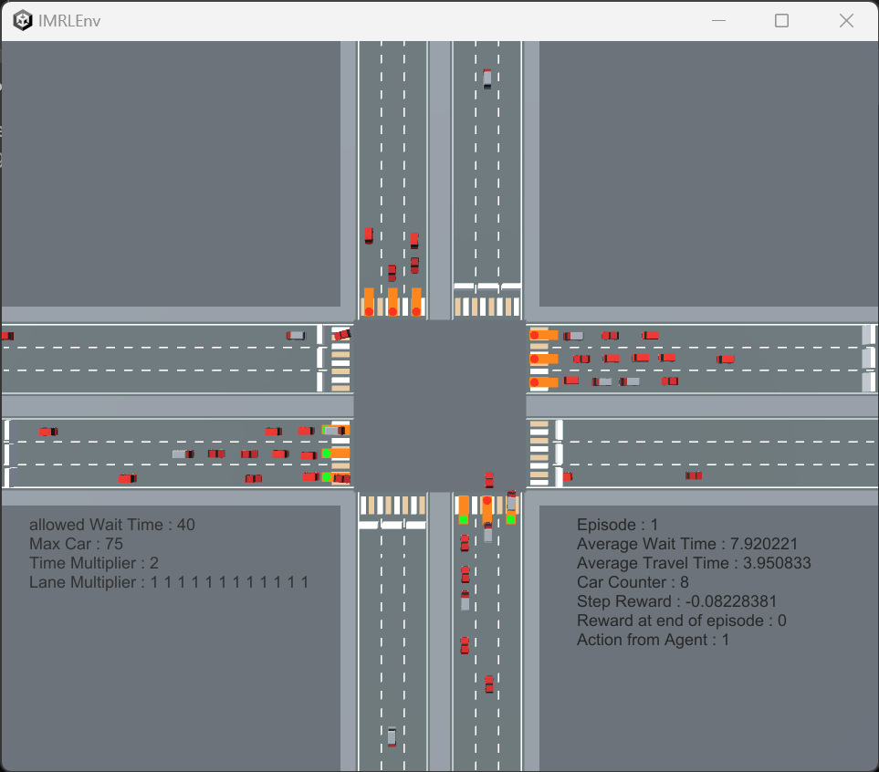

# IMRLEnv (Intersection Management Reinforcement Learning Environment)



This project is Reinforcement Learning Environment to make optimized agent controls intersection with traffic lights

Made with Unity and powered by [unity ml-agent](https://github.com/Unity-Technologies/ml-agents) and [iTS - Intelligent Traffic System](https://assetstore.unity.com/packages/templates/systems/its-intelligent-traffic-system-source-22765)

## How to execute

Clone this repository. Then, inside ./agents, execute 'IMRLEnv_main.py' like this

```python IMRLEnv_main.py --platform PLATFORM_YOU_WANT```

at PLATFORM_YOU_WANT, put ```windows-desktop``` to use windows desktop environment, put ```windows-server``` to use windows headless environment, put ```linux-desktop``` to use linux desktop environment. 

Linux headless environment is default, so you don't need to enter anything at --platform and execute like this

```python3 IMRLEnv_main.py```

Arguments may added further.

## How this environment works


- Environment Overview
  - Environment is four-way intersection. 
  - Each road have 6 lanes. Each lane has specific directions(left turn, straight, right turn). 
  - Each lane has traffic light with red, yellow, green light.

- Observation : vector observation
  - Traffic Light State : one-hot encoding : 3*12
  - Vehicles average waiting time by lanes : 12
  - Total observation size : 48

- Action : Discrete
  - Pre-defined action : if action has conflicting another traffic light state, TR Manager will change that state
  - If there are no conflicting Traffic Light State(right turn), action can turn on&off green light
  - Total action size : 12

- Reward
  - At every step, "diffence of average waiting time" will given as reward
  - "diffence of average waiting time" = (reward of before step) - (normalized average waiting time of this step)

- End of Episode
  - When certain amount of vehicles pass through Intersection
  - When "total average waiting time" exceed "allowed waiting time"

## Agents

- Random Agent
- DQN based Agent(Work in Progress)

## Platform Setting

There are four version of the env

- Linux Desktop : not tested
- Linux Headless : not tested
- Windows Desktop : tested with Random Agent, working
- Windows Headless : tested with Random Agent, working

Also, this environment was tested in these conditions

- both Linux and Windows 11
  - Unity ML-Agent (unity) : 2.0.0 
  - mlagents, mlagents-env : 0.26.0

- At Windows 11
  - python 3.7.16 working on anaconda
  - torch : 1.8.0+cu111
  - CUDA : 11.8
  
- At Linux(Ubuntu 20.04)
  - python 3.8.17 working on anaconda
  - protobuf : 3.20.0
  - CUDA : 11.4

## Changes

- 2023.09.14 : changed reward with "diffence of average waiting time", made server version app displays information of env in console at the begining of episode.
- 2023.09.13 : made DQN agnet(not confirmed) and changed folder names to run IMRLEnv_main.py easily
- 2023.08.21 : solved environment reset problem, uploaded several different platform version of IMRLEnv, add argument option to select platform.
- 2023.08.17 : first commit
