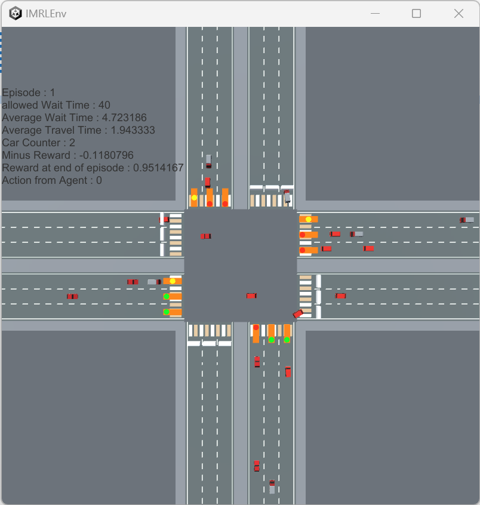
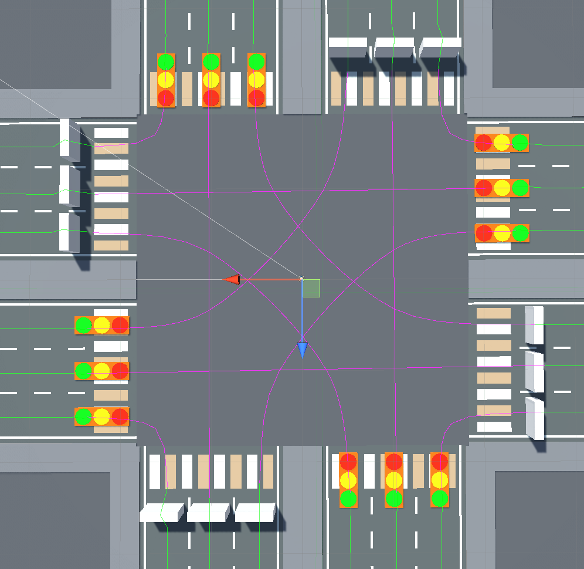

# IMRLEnv (Intersection Management Reinforcement Learning Environment)

This project is Reinforcement Learning Environment to make optimized agent controls intersection with traffic lights

Made with Unity and powered by [unity ml-agent](https://github.com/Unity-Technologies/ml-agents) and [iTS - Intelligent Traffic System](https://assetstore.unity.com/packages/templates/systems/its-intelligent-traffic-system-source-22765)

## How this environment works

- Environment Overview
  - Environment is four-way intersection. 
  - Each road have 6 lanes. Each lane has specific directions(left turn, straight, right turn). 
  - Each lane has traffic light with red, yellow, green light.

- Observation : vector observation
  - Traffic Light State : one-hot encoding : 3*112
  - Vehicles average waiting time by lanes : 12
  - Total observation size : 48

- Action : Discrete
  - Pre-defined action : if action has conflicting another traffic light state, TR Manager will change that state
  - If there are no conflicting Traffic Light State(right turn), action can turn on&off green light
  - Total action size : 12

- Reward
  - At every step, "scaled total average waiting time" will given as minus reward
  - At the end of episode, "scaled total average traveling time will given as plus reward

- End of Episode
  - When certain amount of vehicles pass through Intersection
  - When "total average waiting time" exceed "allowed waiting time"

## Agents

- Random Agent
- DQN based Agent(Work in Progress)

## platform

Environment currently works on Windows. In Linux, have to check.

## Current Issue

It is not done yet because of these issues

1. When episode ends and start another episode, vehicles spawned by TSTrafficSpawner won't move properly. 
2. Step Reward is too large

When these issues are solved, environment should work well.